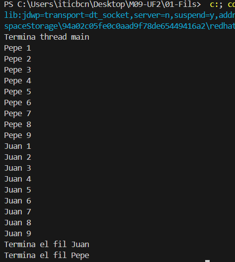

## Comportament 1

En aquesta primera execució es pot veure com els fils juan i pepe s'intercalen més o menys amb un mateix cicle. S'han creat en aquest cas els Fil implementant Runnable per veure el comportament dels Threads en Principal

## Comportament 2

En aquesta segina execucií s'han canviat les prioritats dels fils per arribar a l'output esperat, s'ha hagut de crear els Threads per poder realitzar el setPriority.