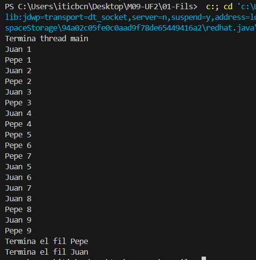

## Comportament 1

En aquesta primera execució es pot veure com els fils juan i pepe s'intercalen més o menys amb un mateix cicle. S'han creat en aquest cas els Fil implementant Runnable per veure el comportament dels Threads en Principal

## Comportament 2

En aquesta segina execució s'han canviat les prioritats dels fils per arribar a l'output esperat, s'ha hagut de crear els Threads per poder realitzar el setPriority.

## Comportament 3

En aquesta tercera execució per sincronitzar tots dos fils faig que hi hagi un aturament de les accions amb Thread.yield al moment de fer el print a la funció run() de Fil, després utilitzo join per que una vegada el run s'executi s'esperi a l'altre fil per continuar aixi es pot intercalar les accions.